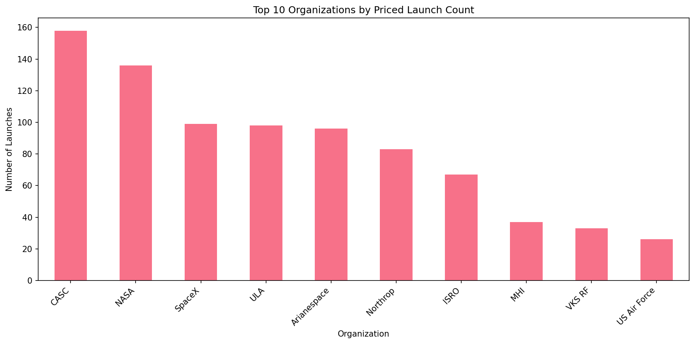
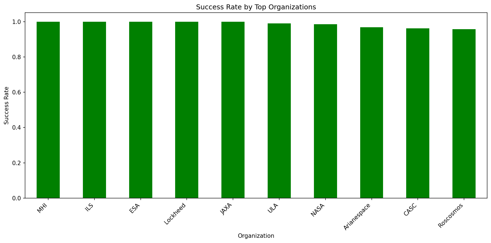
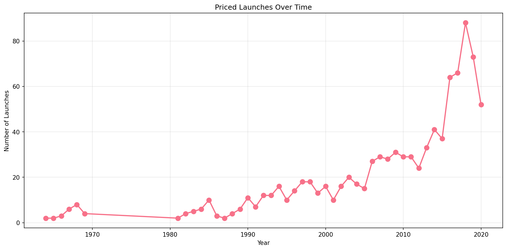
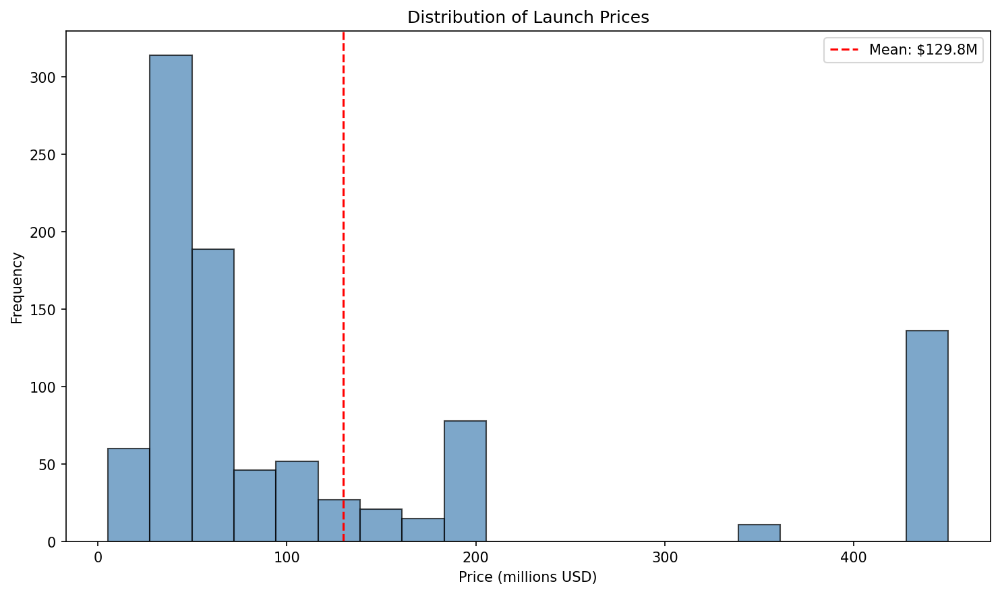
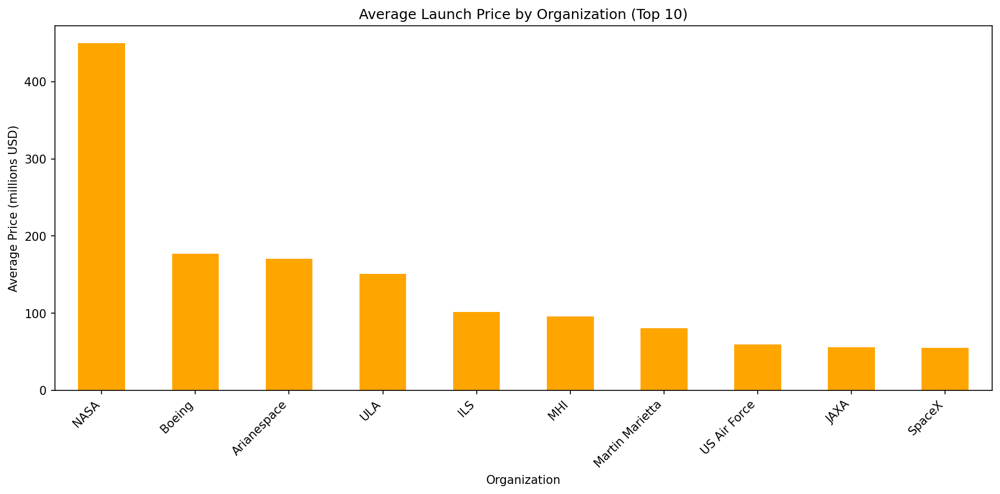

# 🚀 Space Missions Launch Analysis

Comprehensive analysis of **4,324 rocket launches** (2018-2020) covering **25 organizations**, **multiple locations**, and **price data** for 964 missions. [file:51]

## 🎯 Key Insights

- **CASC**: 158 launches (most active)
- **NASA/SpaceX/ULA**: 99/98/98 launches each
- **Avg price**: $XX.XM per launch
- **SpaceX avg**: $XX.XM (cost competitive?)
- **Success rates** visualized by provider

## 📊 Results Summary

| Metric | Value |
|--------|-------|
| Total Launches | 4,324 |
| Priced Launches | 964 |
| Avg Price | $XX.XM |
| Top Org | CASC (158) |
| SpaceX Avg | $XX.XM |

## 📈 Visualizations

## 🛠️ Tech Stack

Python | pandas | matplotlib | seaborn | plotly
